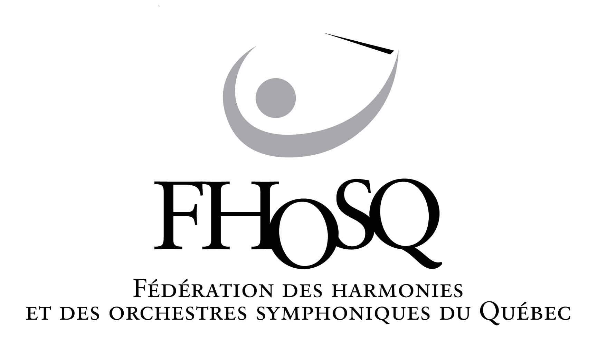

# Guide sanitaire pour les ensembles musicaux

> Guide sanitaire pour les ensembles musicaux écrit par Normand Gosselin,
> enseignant, compositeur et organisateur d'événement musical et la Fédération
> des Harmonies et Orchestres Symphoniques du Québec (FAMEQ), pour les membres
> de la FAMEQ et de la Fédération des Associations de Musiciens Éducateurs du
> Québec.

    

        
    

    

        
    

# Introduction

Suite à l’apparition de la COVID-19, beaucoup de questionnements et
d’inquiétudes face à la pratique musicale et aux risques de contagion se sont
fait entendre. Les enjeux sont très importants et la communauté doit être
informée sur les bonnes pratiques sanitaires. Ce document, basé sur plusieurs
articles et sur les recommandations du Gouvernement du Québec, a pour but de
renseigner et d’aider les enseignants de musique, les directeurs musicaux et les
musiciens à développer de bonnes pratiques lors de la reprise des activités.

> Ce document a été rédigé selon les mesures en place au 2 juillet 2020 et sera
> mis à jour régulièrement selon les articles à paraître et les recommandations
> du Gouvernement du Québec.

